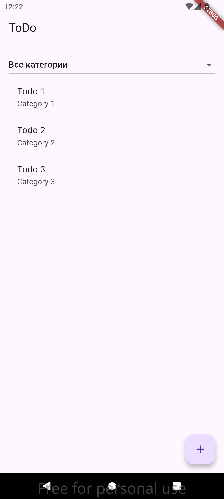

# Flutter REST Todo App
Простое ToDo приложение, построенное с использованием Flutter и Riverpod, с REST API в качестве бэкенда. Приложение демонстрирует принципы Clean Architecture и современные подходы к управлению состоянием.

## Особенности
- Просмотр задач по категориям
- Создание новых задач
- Фильтрация по категориям
- Автоматическое обновление списка
- Логирование сетевых запросов в режиме отладки
- Полноценная обработка ошибок

## Скриншоты
### Список задач

### Форма создания задачи


## Технологии
- **Flutter** 3.19+
- **Riverpod** - управление состоянием
- **Dio** - HTTP-клиент
- **Equatable** - сравнение объектов
- **Fast Immutable Collections** - неизменяемые коллекции
- **Clean Architecture** - организация кода

## Структура проекта
```plaintext
lib/
├── domain/
│   ├── entities/      # Бизнес-сущности
│   ├── repositories/  # Абстракции репозиториев
│   └── usecases/      # Бизнес-логика
├── data/
│   ├── models/        # Модели данных
│   ├── datasources/   # Источники данных
│   └── repositories/  # Реализации репозиториев
└── presentation/
    ├── providers/     # Провайдеры Riverpod
    └── screens/       # UI-экраны
```

## Установка и запуск
1. Клонируйте репозиторий:

```bash
git clone https://github.com/i-panov/flutter-rest-todo.git
```

2. Перейдите в директорию проекта:

```
bash
cd flutter-rest-todo
```

3. Установите зависимости:

```
bash
flutter pub get
```

4. Запустите приложение:

```
bash
flutter run
```

## Конфигурация
Приложение использует публичное REST API:

```plaintext
https://my-json-server.typicode.com/i-panov/flutter_rest_todo
```

Для изменения базового URL отредактируйте файл:
`lib/presentation/providers/todo_providers.dart`

## Особенности реализации
1. **Clean Architecture**:
   - Чёткое разделение на domain (сущности, репозитории), data (реализации, источники данных) и presentation (UI, состояние)
   - Инверсия зависимостей через внедрение реализаций в конструкторы
   - Независимость бизнес-логики от фреймворков

2. **Управление состоянием с Riverpod**:
   - StateNotifier для управления состоянием списка задач
   - FutureProvider для асинхронной загрузки категорий
   - Комбинированные провайдеры для фильтрации задач
   - Селективное чтение провайдеров для оптимизации

3. **Оптимизация производительности**:
   - Неизменяемые коллекции (IList) для безопасного управления состоянием
   - Мемоизация вычисляемых значений (автоматическая в Riverpod)
   - Ленивая инициализация зависимостей

4. **Обработка ошибок**:
   - Глобальный перехват исключений в репозитории
   - Локальная обработка ошибок в UI слое
   - Пользовательские уведомления через SnackBar
   - Состояния загрузки для всех асинхронных операций

## Лицензия
Этот проект распространяется под лицензией MIT.
